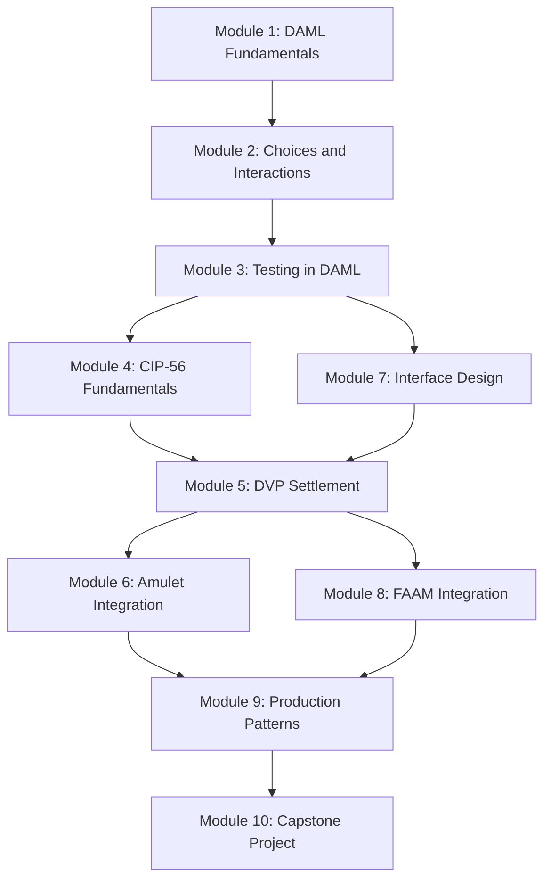
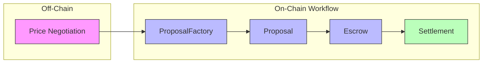
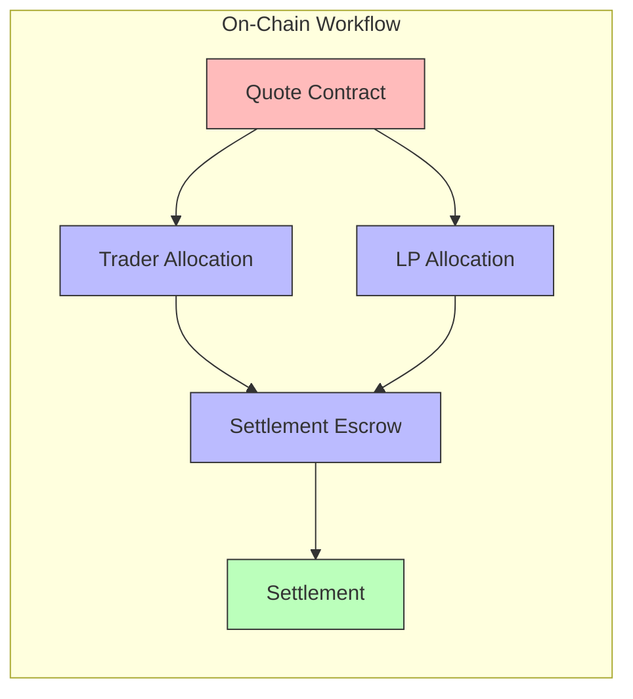

# Build a DEX with DAML: Mastering the Canton Token Standard (CIP-56)

## Course Overview

This comprehensive educational course covers DAML smart contract development from fundamentals to advanced Canton Token Standard (CIP-56) integration. Learn to build decentralized exchange (DEX) applications with real-world patterns and best practices.

## Target Audience

Developers with programming experience who are new to DAML and blockchain development.

### Coming from Ethereum/Solidity?

If you have experience with EVM smart contract development, check out our
**[Solidity to DAML Transition Guide](docs/solidity-to-daml-transition-guide.md)** which covers:

- ERC-20 vs DAML Holding patterns
- Ownership (Ownable vs Signatories)
- Role-based access control comparisons
- DEX patterns (Uniswap AMM vs DAML DVP)
- Escrow and Factory pattern equivalents
- Quick reference mapping of Solidity concepts to DAML

## Prerequisites

- Basic programming knowledge (any language)
- Familiarity with functional programming concepts (helpful but not required)
- DAML SDK installed (version 3.4.x or higher) - [Installation Guide](https://docs.digitalasset.com/build/3.4/component-howtos/smart-contracts/index.html)

## Course Structure

### Part 1: DAML Foundations (Modules 1-3)

| Module | Title | Estimated Time |
| ------ | ----- | -------------- |
| [Module 1](docs/module-01-daml-fundamentals.md) | DAML Fundamentals | 2-3 hours |
| [Module 2](docs/module-02-choices-and-interactions.md) | Choices and Contract Interactions | 3-4 hours |
| [Module 3](docs/module-03-testing-in-daml.md) | Testing in DAML | 2-3 hours |

### Part 2: Canton Token Standard (Modules 4-5)

| Module | Title | Estimated Time |
| ------ | ----- | -------------- |
| [Module 4](docs/module-04-cip56-fundamentals.md) | Canton Token Standard (CIP-56) Fundamentals | 4-5 hours |
| [Module 5](docs/module-05-dvp-settlement-patterns.md) | DVP Settlement Patterns | 3-4 hours |

### Part 3: Advanced Integration (Modules 6-8)

| Module | Title | Estimated Time |
| ------ | ----- | -------------- |
| [Module 6](docs/module-06-amulet-token-integration.md) | Amulet Token Integration | 3-4 hours |
| [Module 7](docs/module-07-interface-based-design.md) | Interface-Based Design | 2-3 hours |
| [Module 8](docs/module-08-faam-integration.md) | FAAM Integration | 2-3 hours |

### Part 4: Production and Capstone (Modules 9-10)

| Module | Title | Estimated Time |
| ------ | ----- | -------------- |
| [Module 9](docs/module-09-production-patterns.md) | Production Patterns and Best Practices | 2-3 hours |
| [Module 10](docs/module-10-capstone-project.md) | Capstone Project | 8-12 hours |

Total Estimated Time: 30-45 hours

## Module Dependencies



## Key Concepts Covered

### DAML Fundamentals

- Templates and contracts
- Signatories and observers
- Choices (consuming/non-consuming)
- Data types and records
- Ensure clauses

### Canton Token Standard (CIP-56)

- InstrumentId and token identity
- Holding interface
- Allocation interface
- Lock mechanism
- Settlement patterns

### DVP (Delivery vs Payment)

- Three-phase concurrency solution
- Trade reference ID binding
- Atomic dual allocation execution
- Settlement escrow patterns

### Amulet Integration

- ChoiceContext and ExtraArgs
- Dual factory architecture
- Time-locked holdings
- Disclosure management

### Canton Network Features

- Featured App Activity Markers (FAAM)
- AppRewardBeneficiary configuration
- WalletUserProxy pattern
- CC reward distribution

## Architecture: Two DVP Settlement Patterns

This course teaches two distinct DVP settlement approaches. Understanding the difference is crucial:

### Pattern 1: Off-Chain Price Discovery (Primary Focus)



**Characteristics:**

- Exchange rates agreed off-chain before submission
- Three phases: Create Proposal → Accept Proposal → Settle
- Best for OTC/negotiated trades and learning fundamentals
- Used in: Modules 1, 4, 5, 8, 9

### Pattern 2: On-Chain Price Quoting (Advanced)



**Characteristics:**

- Exchange rates managed on-chain via quote contracts
- Non-consuming choices allow multiple traders
- Best for market makers and high-frequency trading
- Used in: Modules 2, 6, 7 (as examples)

### When to Use Which Pattern

| Scenario | Recommended Pattern |
| -------- | ------------------- |
| Learning DVP fundamentals | Off-Chain Price Discovery |
| OTC/negotiated trades | Off-Chain Price Discovery |
| Market maker with fixed quotes | On-Chain Price Quoting |
| High-frequency trading | On-Chain Price Quoting |

## Exercises Summary

Each module includes practical exercises. Total: **28 exercises + 1 capstone project**

| Module | Exercises | Difficulty |
| ------ | --------- | ---------- |
| 1 | 3 | Beginner |
| 2 | 3 | Beginner |
| 3 | 3 | Beginner |
| 4 | 3 | Intermediate |
| 5 | 3 | Intermediate |
| 6 | 2 | Intermediate |
| 7 | 2 | Intermediate |
| 8 | 2 | Advanced |
| 9 | 2 | Advanced |
| 10 | 1 (Capstone) | Advanced |

## Getting Started

### 1. Set Up Your Environment

```bash
# Ensure DAML SDK is installed
daml version

# Create a new DAML project
daml new my-dex-project

# Navigate to project
cd my-dex-project

# Build the project
daml build
```

### 2. Run Tests

```bash
# Run all tests
daml test

# Run specific test file
daml test --files ./daml/Tests/MyTest.daml
```

### 3. Start Learning

Begin with [Module 1: DAML Fundamentals](docs/module-01-daml-fundamentals.md).

## Documentation Standards

All code examples in these materials:

- Use generic, reusable patterns
- Follow DAML best practices
- Can be adapted to any DEX implementation
- Include explanatory comments

## Additional Resources

### Transition Guides

- [Solidity to DAML Transition Guide](docs/solidity-to-daml-transition-guide.md) - For EVM developers

### Official Documentation

- [DAML Documentation](https://docs.digitalasset.com/build/3.4/)
- [Canton Network Documentation](https://docs.canton.network/)
- [CIP-56 Token Standard](https://github.com/canton-foundation/cips/blob/main/cip-0056/cip-0056.md)
- [What is CIP-56 Token Standard](https://www.canton.network/blog/what-is-cip-56-a-guide-to-cantons-token-standard)
- [Splice](https://hyperledger-labs.github.io/splice/)

### Community

- [DAML Forum](https://discuss.daml.com/)
- [Canton Network Discord](https://discord.gg/RHV8vyXj)
- [Canton Network Telegram](https://t.me/CantonNetwork1)

## Feedback

If you find issues or have suggestions for improvement, please contribute to the community.

---

**Happy Learning!**

*These materials provide practical, real-world examples of DAML and Canton Token Standard development for building decentralized exchange applications.*
