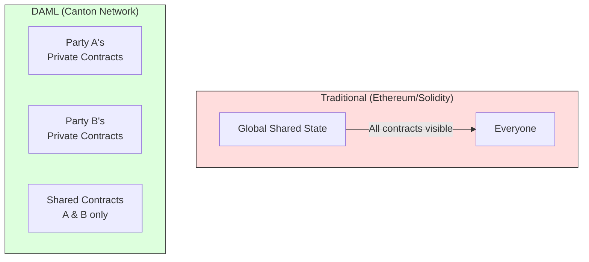
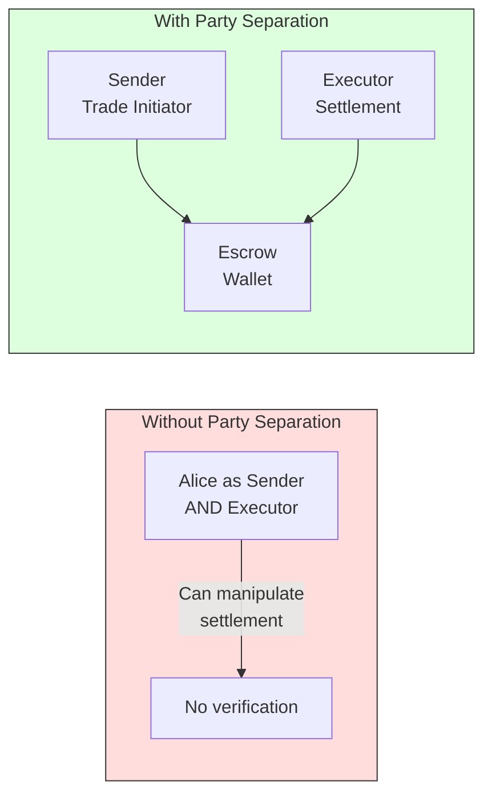

# Module 1: DAML Fundamentals

## Learning Objectives

By the end of this module, you will be able to:

- Understand DAML's functional programming paradigm and its role in smart contract development
- Master template structure and the contract lifecycle
- Define and use signatories, observers, and controllers
- Implement data types with records and deriving clauses
- Apply ensure clauses for contract validation

---

## 1.1 Introduction to DAML

### What is DAML?

DAML (Digital Asset Modeling Language) is a smart contract language designed for building distributed applications with strict privacy and authorization controls. Unlike traditional smart contracts that run on a global shared state, DAML contracts run on a **privacy-preserving ledger** where only authorized parties can see and interact with specific contracts.

### Key Characteristics

| Characteristic | Description |
|----------------|-------------|
| **Functional** | Pure functional programming with immutable data structures |
| **Typed** | Strong static type system catches errors at compile time |
| **Privacy-First** | Contracts are only visible to authorized parties |
| **Deterministic** | Same inputs always produce same outputs |
| **Upgradeable** | Contracts can be upgraded without losing data |

### DAML vs Traditional Smart Contracts



---

## 1.2 Templates: The Foundation of DAML

A **template** in DAML defines the structure and behavior of a contract. Think of it as a class definition in object-oriented programming, but for distributed agreements.

### Basic Template Structure

```haskell
template TemplateName with
    field1: Type1
    field2: Type2
  where
    signatory parties
    observer parties

    ensure condition

    choice ChoiceName: ReturnType
      with
        param1: Type1
      controller parties
      do
        -- choice body
```

### Example: SwapFactory

```haskell
template SwapFactory with
    admin: Party
      -- ^ Admin of the factory contract
  where
    signatory admin
```

**Key Points:**

1. **Template name** (`SwapFactory`) - Unique identifier for this contract type
2. **Fields** (`admin: Party`) - Data stored in the contract
3. **Comments** (`-- ^`) - Documentation comments using Haddock syntax
4. **Signatory** - Parties who must authorize the contract's creation

### The Party Type

`Party` is a fundamental DAML type representing an entity (person, organization, or system) that can:

- Sign contracts (as signatory)
- View contracts (as observer)
- Execute choices (as controller)

```haskell
-- Party declarations
admin: Party           -- Single party
traders: [Party]       -- List of parties
optionalParty: Optional Party  -- Maybe a party
```

---

## 1.3 Signatories and Observers

### Signatories

**Signatories** are parties who must authorize the creation of a contract. They have full visibility of the contract and can exercise certain choices.

```haskell
template SwapOffer with
    sender: Party
    receiver: Party
    executor: Party
    -- ... other fields
  where
    signatory sender, executor  -- Both must sign to create this contract
    observer receiver
```

**Why multiple signatories?**

- `sender` - The party initiating the trade (trader)
- `executor` - The party responsible for settlement

Both must agree to the terms before the contract exists on the ledger.

### Observers

**Observers** can see the contract but cannot exercise arbitrary choices on it. They need explicit permission through `controller` declarations.

```haskell
observer receiver  -- receiver can see the contract
```

### Visibility Rules

| Role | Can See Contract | Can Exercise Any Choice | Can Archive |
|------|-----------------|------------------------|-------------|
| Signatory | Yes | No (only if controller) | Yes |
| Observer | Yes | No (only if controller) | No |
| Other | No | No | No |

### Example: Three-Party Authorization

```haskell
template SwapEscrow with
    sender: Party     -- Trader
    receiver: Party   -- Escrow wallet
    executor: Party   -- Settlement executor
  where
    signatory sender, receiver  -- Both trade parties must sign
    observer executor           -- Executor can see but needs explicit choice control
```

This pattern ensures:

1. Both trade parties (`sender`, `receiver`) agree to the escrow terms
2. The `executor` can observe the escrow but cannot modify it without explicit authorization
3. Separation of concerns between trade parties and settlement authority

---

## 1.4 Data Types and Records

### Record Types

DAML uses **records** to group related data. Records are immutable data structures with named fields.

```haskell
data AllocationArgs = AllocationArgs
  with
    executor: Party
      -- ^ The party who will settle the trade
    amount: Decimal
      -- ^ The amount of the instrument to be transferred
    instrumentId: InstrumentId
      -- ^ The InstrumentId of the input instrument
    allocationFactoryCid: ContractId AllocationFactory
      -- ^ The AllocationFactory contract for the instrument
    inputHoldingCids: [ContractId Holding]
      -- ^ The holdings to be used for the allocation
    allocateBefore: RelTime
      -- ^ The time before which the allocation must be completed
    settleBefore: RelTime
      -- ^ The time before which the settlement must be completed
    extraArgs: ExtraArgs
      -- ^ The extra arguments for the allocation
  deriving (Show, Eq)
```

**Key Concepts:**

1. **`data` keyword** - Defines a new type
2. **`with` block** - Contains field definitions
3. **Field types** - Each field has a specific type
4. **`deriving` clause** - Automatically generates instances

### Deriving Clauses

```haskell
deriving (Show, Eq)
```

| Derived Instance | Provides |
|------------------|----------|
| `Show` | String representation for debugging |
| `Eq` | Equality comparison (`==`, `/=`) |
| `Ord` | Ordering comparison (`<`, `>`, `<=`, `>=`) |

### Result Types

Custom result types encapsulate return values from choices:

```haskell
data SwapEscrowWithAllocationResult = SwapEscrowWithAllocationResult
  with
    swapEscrowCid: ContractId SwapEscrow
    receiverAllocationCid: ContractId Allocation
  deriving (Show, Eq)
```

### Parameterized Types

Types can take parameters for flexibility:

```haskell
data SettlementResult senderRes receiverRes = SettlementResult
  with
    senderChoiceResult: senderRes
    receiverChoiceResult: receiverRes
  deriving (Show, Eq)
```

This type takes two type parameters (`senderRes`, `receiverRes`), allowing it to hold different result types:

```haskell
-- Usage:
SettlementResult TransferResult TransferResult
```

---

## 1.5 The ContractId Type

`ContractId` is a reference to an active contract on the ledger.

```haskell
senderAllocationCid: ContractId Allocation
receiverAllocationCid: ContractId Allocation
```

**Important Properties:**

1. **Type-safe** - `ContractId Allocation` can only reference `Allocation` contracts
2. **Opaque** - You cannot create a `ContractId` from a string; they come from contract creation or queries
3. **Temporary** - A `ContractId` becomes invalid when the contract is archived

### Working with ContractIds

```haskell
-- Creating a contract returns its ContractId
swapEscrowCid <- create SwapEscrow with ...

-- Fetching a contract by its ContractId
allocation <- fetch senderAllocationCid

-- Exercising a choice on a contract
result <- exercise swapEscrowCid SwapEscrow_Execute with ...
```

---

## 1.6 Ensure Clauses: Contract Validation

The `ensure` clause defines invariants that must hold for a contract to be valid. If the condition is `False`, contract creation fails.

### Basic Ensure Clause

```haskell
template SwapEscrow with
    sender: Party
    receiver: Party
    executor: Party
    senderAllocationCid: ContractId Allocation
    receiverAllocationCid: ContractId Allocation
  where
    signatory sender, receiver
    observer executor

    ensure
      sender /= receiver &&
      executor /= sender &&
      executor /= receiver &&
      senderAllocationCid /= receiverAllocationCid
```

**Validation Rules Explained:**

| Rule | Purpose |
|------|---------|
| `sender /= receiver` | Prevents self-trading |
| `executor /= sender` | Executor cannot be the trade initiator |
| `executor /= receiver` | Executor cannot be the trade acceptor |
| `senderAllocationCid /= receiverAllocationCid` | Ensures distinct allocations |

### Why Party Separation Matters



### Ensure vs Runtime Assertions

| Mechanism | When Checked | Failure Result |
|-----------|--------------|----------------|
| `ensure` | At contract creation | Contract never created |
| `assertMsg` | During choice execution | Transaction aborted |

```haskell
-- ensure: checked at creation
ensure amount > 0.0

-- assertMsg: checked during execution
assertMsg "Amount must be positive" (amount > 0.0)
```

---

## 1.7 Module Structure and Imports

### Module Declaration

Every DAML file starts with a module declaration:

```haskell
module Swap.Factory where
```

The module name must match the file path:

- File: `Swap/Factory.daml`
- Module: `Swap.Factory`

### Import Statements

```haskell
module Swap.Factory where

import DA.Text (sha256)

import Splice.Api.Token.HoldingV1 (InstrumentId (..))
import Splice.Api.Token.AllocationV1 (Allocation, Reference (..))
import Splice.Api.Token.AllocationInstructionV1 (AllocationInstructionResult_Output (..))

import Utils.ValidationUtils (validateHoldings)
import Utils.RewardUtils (createFAAM)

import Swap.Offer (SwapOffer (..))
import Swap.Types (AllocationArgs (..))
import Swap.SwapHelper (createProxiedAllocation)
```

### Import Patterns

| Pattern | Example | Meaning |
|---------|---------|---------|
| Basic | `import DA.Text (sha256)` | Import specific function |
| Type + Constructors | `import Module (Type (..))` | Import type and all constructors |
| Qualified | `import Module qualified as M` | Access as `M.function` |
| Full Module | `import Module` | Import all exports |

---

## 1.8 Common DAML Types

### Primitive Types

| Type | Description | Example |
|------|-------------|---------|
| `Party` | Ledger participant | `alice: Party` |
| `Text` | Unicode string | `"Hello"` |
| `Int` | Integer | `42` |
| `Decimal` | Decimal number | `100.50` |
| `Bool` | Boolean | `True`, `False` |
| `Time` | Timestamp | `getTime` |
| `RelTime` | Duration | `hours 24` |

### Container Types

| Type | Description | Example |
|------|-------------|---------|
| `[a]` | List | `[1, 2, 3]` |
| `Optional a` | Maybe value | `Some 42`, `None` |
| `ContractId a` | Contract reference | `ContractId Allocation` |
| `TextMap a` | Key-value map | `TextMap.fromList [("k", v)]` |

### Time Operations

```haskell
import DA.Time

-- Get current ledger time
now <- getTime

-- Create relative time
let oneDay = hours 24
let oneWeek = days 7

-- Add relative time to absolute time
let deadline = now `addRelTime` oneDay
```

---

## 1.9 Exercises

### Exercise 1.1: Create a Simple Asset Template

Create a template representing a digital asset with:

- `issuer: Party` (signatory)
- `owner: Party` (signatory)
- `assetName: Text`
- `quantity: Decimal`

Ensure that `quantity > 0.0`.

<details>
<summary>Solution</summary>

```haskell
template DigitalAsset with
    issuer: Party
    owner: Party
    assetName: Text
    quantity: Decimal
  where
    signatory issuer, owner

    ensure quantity > 0.0
```

</details>

### Exercise 1.2: Define a Result Type

Create a data type for a transfer result containing:

- `fromHolding: ContractId Holding`
- `toHolding: ContractId Holding`
- `transferredAmount: Decimal`

<details>
<summary>Solution</summary>

```haskell
data TransferResult = TransferResult
  with
    fromHolding: ContractId Holding
    toHolding: ContractId Holding
    transferredAmount: Decimal
  deriving (Show, Eq)
```

</details>

### Exercise 1.3: Three-Party Escrow Template

Create a template for a payment escrow with:

- `payer: Party` (signatory)
- `payee: Party` (observer)
- `escrowAgent: Party` (signatory)
- `amount: Decimal`

Ensure all parties are distinct and amount is positive.

<details>
<summary>Solution</summary>

```haskell
template PaymentEscrow with
    payer: Party
    payee: Party
    escrowAgent: Party
    amount: Decimal
  where
    signatory payer, escrowAgent
    observer payee

    ensure
      payer /= payee &&
      payer /= escrowAgent &&
      payee /= escrowAgent &&
      amount > 0.0
```

</details>

---

## 1.10 Summary

### Key Takeaways

1. **Templates** define contract structure and behavior
2. **Signatories** must authorize contract creation and can archive contracts
3. **Observers** can view contracts but need explicit choice authorization
4. **Data types** with `deriving` provide structured data with automatic instances
5. **Ensure clauses** validate invariants at contract creation time
6. **ContractId** provides type-safe references to active contracts

### DAML Design Principles

| Principle | Application |
|-----------|-------------|
| **Explicit Authorization** | All actions require explicit party consent |
| **Privacy by Default** | Contracts visible only to signatories/observers |
| **Immutability** | Contracts cannot be modified; new versions are created |
| **Type Safety** | Compile-time checking prevents many errors |

### Next Module Preview

In **Module 2: Choices and Contract Interactions**, you will learn:

- How to define and exercise choices
- Consuming vs non-consuming choices
- The factory pattern for contract creation
- Controller authorization patterns
