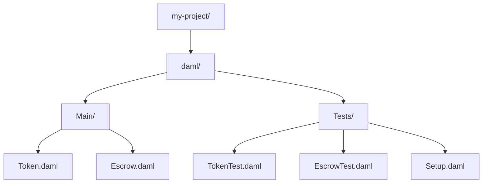

# Module 3: Testing in DAML

## Learning Objectives

By the end of this module, you will be able to:

- Master the Daml.Script testing framework
- Understand party allocation and submission patterns
- Write assertions and validation tests
- Organize test infrastructure with configuration types
- Query contracts and verify state changes

---

## 3.1 Introduction to Daml.Script

**Daml.Script** is DAML's testing framework that allows you to simulate ledger interactions in a controlled environment.

### Key Concepts

| Concept | Description |
|---------|-------------|
| **Script** | A sequence of ledger operations for testing |
| **Party Allocation** | Creating test parties |
| **Submission** | Executing commands as a party |
| **Query** | Reading contract state |
| **Assert** | Validating expected outcomes |

### Basic Test Structure

```haskell
module Tests.MyTest where

import Daml.Script
import DA.Assert

myTest: Script ()
myTest = do
  -- 1. Setup: Allocate parties
  alice <- allocateParty "Alice"
  bob <- allocateParty "Bob"

  -- 2. Execute: Create and exercise contracts
  cid <- submit alice do
    createCmd MyContract with owner = alice, amount = 100.0

  -- 3. Verify: Check results
  Some contract <- queryContractId alice cid
  contract.amount === 100.0

  pure ()
```

---

## 3.2 Party Allocation

### Basic Allocation

```haskell
-- Simple allocation with display name
alice <- allocateParty "Alice"

-- Allocation with specific hint (for deterministic IDs)
trader <- allocatePartyByHint (PartyIdHint "Trader")
```

### Multiple Parties

Example:

```haskell
trader2 <- allocatePartyByHint (PartyIdHint "Trader2")
trader3 <- allocatePartyByHint (PartyIdHint "Trader3")
```

### Party Configuration Pattern

Using parameterized types for flexible party allocation:

Pattern:

```haskell
-- Generic party roles with parameterized party type
data PartyRoles partyRef = PartyRoles with
  liquidityProvider : partyRef
  trader : partyRef
  appProvider : Optional Party
  executor : Optional Party
    deriving (Eq, Show)

-- Optional party roles (for lazy allocation)
type OptionalPartyRoles = PartyRoles (Optional Party)

-- Concrete party roles (all required)
type RequiredPartyRoles = PartyRoles Party
```

### Expanded Roles Pattern

Pattern:

```haskell
-- Fully expanded roles with all parties required
data ExpandedRoles = ExpandedRoles with
  liquidityProvider : Party
  trader : Party
  appProvider : Party
  executor : Party
    deriving (Eq, Show)
```

This pattern allows:

1. Optional configuration (user provides some parties, test allocates others)
2. Type safety (expanded roles guarantee all parties exist)
3. Reusability across different test scenarios

---

## 3.3 Submission Patterns

### Basic Submit

```haskell
cid <- submit alice do
  createCmd MyContract with ...
```

### Submit with Multiple Actions

```haskell
submit alice do
  cid1 <- createCmd Contract1 with ...
  cid2 <- createCmd Contract2 with ...
  exerciseCmd cid1 SomeChoice with ...
```

### actAs and readAs

For fine-grained authorization control:

Example:

```haskell
(trader1AllocationCid, swapSettlementCid1, outputAmount1) <- submit
    (actAs [roles.trader] <>
    readAs [roles.executor, providedAdmin]) do
      exerciseCmd priceQuoteCid CreateTraderAllocation with
        trader = roles.trader
        inputAmount
        swapHoldings = map (coerceContractId . fst) holdings.desired
        amuletContext = None
        featuredAppRightCid = None
        beneficiaries = None
```

**Key Points:**

- `actAs [party]` - Submit commands as this party
- `readAs [parties]` - Can read contracts visible to these parties
- `<>` - Combine permissions (Semigroup)

### Disclosure Patterns

For cross-party visibility:

```haskell
submit (actAs [roles.trader] <> discloseMany allDisclosures) do
    exerciseCmd tradeProposalFactory SwapFactory_CreateSwapOfferAndAllocate with
      sender = roles.trader
      receiver = roles.escrowWallet
```

---

## 3.4 Assertions and Validation

### DA.Assert Module

```haskell
import DA.Assert

-- Equality assertion
result === expectedValue

-- Inequality assertion
result =/= unexpectedValue

-- With custom message
assertMsg "Amount must be positive" (amount > 0.0)
```

### Query and Verify

Example:

```haskell
-- Query contracts by interface
allocations <- queryInterface @Allocation provider.primaryParty

-- Query specific contract by ID
Some escrow <- queryContractId @Escrow provider.primaryParty escrowCid
```

### Debug Output

```haskell
debug $ "Expected output amount: " <> show expectedOutputAmount
debug "--------------------------------"
debug $ "Trader2: " <> show trader2
```

### Negative Testing with submitMustFail

```haskell
-- Test that invalid operations fail
submitMustFail alice do
  createCmd MyContract with
    amount = -100.0  -- Should fail ensure clause
```

### Try Submit Pattern

```haskell
import DA.Either (isLeft, isRight)

result <- trySubmit alice do
  exerciseCmd cid SomeChoice with ...

-- Check if it succeeded or failed
when (isLeft result) do
  debug "Operation failed as expected"
```

---

## 3.5 Test Configuration Patterns

Using configuration types makes tests reusable and easier to maintain.

### Simple Configuration Type

```haskell
-- Configuration for escrow tests
data EscrowTestConfig = EscrowTestConfig with
  buyerName: Text
  sellerName: Text
  escrowAmount: Decimal
  description: Text
    deriving (Show, Eq)

-- Default configuration
defaultEscrowConfig : EscrowTestConfig
defaultEscrowConfig = EscrowTestConfig with
  buyerName = "buyer"
  sellerName = "seller"
  escrowAmount = 1000.0
  description = "Test escrow"
```

### Test Preset Pattern

A preset bundles all the setup results together:

```haskell
-- Preset containing all test setup results
data EscrowTestPreset = EscrowTestPreset with
  buyer: Party
  seller: Party
  arbiter: Party
  escrowCid: ContractId Escrow
    deriving (Show, Eq)

-- Setup function creates the preset
setupEscrowTest : EscrowTestConfig -> Script EscrowTestPreset
setupEscrowTest config = do
  -- Allocate parties
  buyer <- allocateParty config.buyerName
  seller <- allocateParty config.sellerName
  arbiter <- allocateParty "arbiter"

  -- Create initial escrow contract
  escrowCid <- submit buyer do
    createCmd Escrow with
      buyer
      seller
      arbiter
      amount = config.escrowAmount
      description = config.description

  pure EscrowTestPreset with ..
```

### Using Presets in Tests

```haskell
testEscrowRelease : Script ()
testEscrowRelease = do
  -- Setup with default config
  preset <- setupEscrowTest defaultEscrowConfig

  -- Use the preset
  submit preset.buyer do
    exerciseCmd preset.escrowCid Release

  -- Verify escrow is archived
  result <- queryContractId preset.buyer preset.escrowCid
  result === None
```

### Parameterized Tests

Run the same test with different configurations:

```haskell
testMultipleAmounts : Script ()
testMultipleAmounts = do
  -- Test with different amounts
  forA_ [100.0, 500.0, 1000.0] $ \amount -> do
    let config = defaultEscrowConfig with escrowAmount = amount
    preset <- setupEscrowTest config

    -- Run test logic
    submit preset.buyer do
      exerciseCmd preset.escrowCid Release

    debug $ "Test passed for amount: " <> show amount
```

---

## 3.6 Setup Functions

Setup functions create the test environment. Keep them simple and focused.

### Basic Party Setup

```haskell
-- Simple setup: just allocate parties
setupParties : Script (Party, Party, Party)
setupParties = do
  alice <- allocateParty "Alice"
  bob <- allocateParty "Bob"
  charlie <- allocateParty "Charlie"
  pure (alice, bob, charlie)
```

### Setup with Initial Contracts

```haskell
-- Setup that creates initial state
data TokenTestSetup = TokenTestSetup with
  issuer: Party
  holder: Party
  tokenCid: ContractId Token
    deriving (Show, Eq)

setupTokenTest : Decimal -> Script TokenTestSetup
setupTokenTest initialAmount = do
  issuer <- allocateParty "Issuer"
  holder <- allocateParty "Holder"

  -- Create initial token
  tokenCid <- submitMulti [issuer, holder] [] do
    createCmd Token with
      issuer
      owner = holder
      amount = initialAmount

  pure TokenTestSetup with ..
```

### Factory Setup Pattern

For tests requiring a factory contract:

```haskell
data FactoryTestSetup = FactoryTestSetup with
  admin: Party
  users: [Party]
  factoryCid: ContractId TokenFactory
    deriving (Show, Eq)

setupFactoryTest : Int -> Script FactoryTestSetup
setupFactoryTest numUsers = do
  admin <- allocateParty "Admin"

  -- Allocate user parties
  users <- forA [1..numUsers] $ \i ->
    allocateParty ("User" <> show i)

  -- Create factory
  factoryCid <- submit admin do
    createCmd TokenFactory with
      admin
      allowedMinters = users

  pure FactoryTestSetup with ..
```

### Reusable Helper Functions

```haskell
-- Helper to create a token and return its CID
createToken : Party -> Party -> Decimal -> Script (ContractId Token)
createToken issuer owner amount = do
  submitMulti [issuer, owner] [] do
    createCmd Token with issuer, owner, amount

-- Helper to transfer a token
transferToken : Party -> ContractId Token -> Party -> Script (ContractId Token)
transferToken currentOwner tokenCid newOwner = do
  submit currentOwner do
    exerciseCmd tokenCid Transfer with newOwner

-- Use helpers in tests
testTokenTransfer : Script ()
testTokenTransfer = do
  (alice, bob, _) <- setupParties

  -- Create and transfer using helpers
  tokenCid <- createToken alice alice 100.0
  newTokenCid <- transferToken alice tokenCid bob

  -- Verify
  Some token <- queryContractId bob newTokenCid
  token.owner === bob
```

---

## 3.7 Query Patterns

### Query by Contract ID

```haskell
-- Query specific contract
Some contract <- queryContractId @Token holder tokenCid

-- Access contract fields
debug $ "Owner: " <> show contract.owner
debug $ "Amount: " <> show contract.amount
```

### Query by Template Type

```haskell
-- Query all contracts of a type visible to a party
tokens <- query @Token holder

-- Returns [(ContractId Token, Token)] pairs
debug $ "Found " <> show (length tokens) <> " tokens"

-- Access specific token
case tokens of
  [] -> debug "No tokens found"
  (cid, token) :: _ -> debug $ "First token amount: " <> show token.amount
```

### Query by Interface

Interfaces allow querying across multiple template types:

```haskell
-- Query all contracts implementing an interface
assets <- queryInterface @Asset holder

-- Returns [(ContractId Asset, AssetView)] pairs
forA_ assets $ \(cid, view) ->
  debug $ "Asset value: " <> show view.value
```

### Filter Query Results

```haskell
-- Query and filter by condition
allTokens <- query @Token holder
let largeTokens = filter (\(_, t) -> t.amount > 100.0) allTokens

debug $ "Large tokens: " <> show (length largeTokens)

-- Find specific token
let maybeToken = find (\(_, t) -> t.owner == alice) allTokens
case maybeToken of
  None -> debug "Token not found"
  Some (cid, token) -> debug $ "Found token: " <> show token.amount
```

### Query with Optional Result

```haskell
-- queryContractId returns Optional
result <- queryContractId @Token holder tokenCid

case result of
  None -> debug "Contract not found (may be archived)"
  Some token -> debug $ "Found: " <> show token
```

---

## 3.8 State Verification

### Before/After Pattern

Verify state changes by comparing before and after:

```haskell
testTransferChangesOwner : Script ()
testTransferChangesOwner = do
  (alice, bob, _) <- setupParties

  -- Create token owned by Alice
  tokenCid <- submitMulti [alice, bob] [] do
    createCmd Token with
      issuer = alice
      owner = alice
      amount = 100.0

  -- Verify initial state
  Some tokenBefore <- queryContractId alice tokenCid
  tokenBefore.owner === alice

  -- Perform transfer
  newTokenCid <- submit alice do
    exerciseCmd tokenCid Transfer with newOwner = bob

  -- Verify final state
  Some tokenAfter <- queryContractId bob newTokenCid
  tokenAfter.owner === bob
  tokenAfter.amount === tokenBefore.amount  -- Amount unchanged
```

### Counting Contracts

```haskell
testFactoryCreatesTokens : Script ()
testFactoryCreatesTokens = do
  admin <- allocateParty "Admin"
  user <- allocateParty "User"

  -- Count tokens before
  tokensBefore <- query @Token user
  let countBefore = length tokensBefore

  -- Create token via factory
  factoryCid <- submit admin do
    createCmd TokenFactory with admin, allowedMinters = [user]

  submit user do
    exerciseCmd factoryCid MintToken with
      owner = user
      amount = 50.0

  -- Count tokens after
  tokensAfter <- query @Token user
  let countAfter = length tokensAfter

  -- Verify one new token created
  countAfter === countBefore + 1
```

### Balance Verification Helper

```haskell
-- Helper to sum token amounts for a party
getTokenBalance : Party -> Script Decimal
getTokenBalance party = do
  tokens <- query @Token party
  let ownedTokens = filter (\(_, t) -> t.owner == party) tokens
  pure $ sum $ map (\(_, t) -> t.amount) ownedTokens

-- Use in tests
testBalanceAfterTransfer : Script ()
testBalanceAfterTransfer = do
  (alice, bob, _) <- setupParties

  -- Setup: Alice has 100, Bob has 0
  tokenCid <- createToken alice alice 100.0

  aliceBalanceBefore <- getTokenBalance alice
  bobBalanceBefore <- getTokenBalance bob
  aliceBalanceBefore === 100.0
  bobBalanceBefore === 0.0

  -- Transfer 100 from Alice to Bob
  submit alice do
    exerciseCmd tokenCid Transfer with newOwner = bob

  -- Verify balances changed correctly
  aliceBalanceAfter <- getTokenBalance alice
  bobBalanceAfter <- getTokenBalance bob
  aliceBalanceAfter === 0.0
  bobBalanceAfter === 100.0
```

---

## 3.9 Test Organization

### Test File Structure

A typical DAML project test structure:



### Naming Conventions

| Pattern | Example | Purpose |
|---------|---------|---------|
| `*Test.daml` | `TokenTest.daml` | Tests for a specific template |
| `Test*.daml` | `TestHappyPath.daml` | Tests for a scenario |
| `Setup.daml` | `Setup.daml` | Shared test setup functions |

### Test Categories

1. **Unit Tests** - Test individual choices
2. **Integration Tests** - Test multi-contract workflows
3. **Validation Tests** - Test error conditions
4. **End-to-End Tests** - Test complete scenarios

---

## 3.10 Common Testing Patterns

### Happy Path Testing

```haskell
testHappyPath: Script ()
testHappyPath = do
  -- Setup
  (preset, config) <- initializeAppLightweight testConfig

  -- Execute the main workflow
  result <- submit trader do
    exerciseCmd contractCid MainChoice with ...

  -- Verify success
  result.status === "completed"
```

### Error Case Testing

```haskell
testInvalidAmount: Script ()
testInvalidAmount = do
  -- Setup
  (preset, config) <- initializeAppLightweight testConfig

  -- Expect failure for invalid input
  submitMustFail trader do
    exerciseCmd contractCid MainChoice with
      amount = -100.0  -- Invalid!
```

### Concurrent Operations Testing

Example:

```haskell
-- Multiple traders create allocations against same quote
(trader1AllocationCid, _, outputAmount1) <- submit (actAs [roles.trader] <> readAs [...]) do
    exerciseCmd priceQuoteCid CreateTraderAllocation with trader = roles.trader, ...

(trader2AllocationCid, _, outputAmount2) <- submit (actAs [trader2] <> readAs [...]) do
    exerciseCmd priceQuoteCid CreateTraderAllocation with trader = trader2, ...

(trader3AllocationCid, _, outputAmount3) <- submit (actAs [trader3] <> readAs [...]) do
    exerciseCmd priceQuoteCid CreateTraderAllocation with trader = trader3, ...

-- All three succeed because CreateTraderAllocation is non-consuming
```

---

## 3.11 Exercises

### Exercise 3.1: Write a Basic Test

Create a test script that:

1. Allocates two parties: `issuer` and `holder`
2. Creates a `Token` contract with `amount = 100.0`
3. Queries and verifies the token amount

<details>
<summary>Solution</summary>

```haskell
module Tests.BasicTokenTest where

import Daml.Script
import DA.Assert

basicTokenTest: Script ()
basicTokenTest = do
  -- Allocate parties
  issuer <- allocateParty "Issuer"
  holder <- allocateParty "Holder"

  -- Create token
  tokenCid <- submit issuer do
    createCmd Token with
      admin = issuer
      owner = holder
      amount = 100.0

  -- Query and verify
  Some token <- queryContractId holder tokenCid
  token.amount === 100.0

  pure ()
```

</details>

### Exercise 3.2: Test Configuration Pattern

Create a test configuration type and initialization function for a simple escrow test:

1. Define `EscrowTestConfig` with `buyer`, `seller`, and `amount`
2. Create `initializeEscrowTest` that allocates parties
3. Write a test using the configuration

<details>
<summary>Solution</summary>

```haskell
module Tests.EscrowConfigTest where

import Daml.Script
import DA.Assert

data EscrowTestConfig = EscrowTestConfig with
  buyer: Optional Party
  seller: Optional Party
  amount: Decimal

data EscrowTestPreset = EscrowTestPreset with
  buyer: Party
  seller: Party
  amount: Decimal

initializeEscrowTest: EscrowTestConfig -> Script EscrowTestPreset
initializeEscrowTest config = do
  buyer <- case config.buyer of
    Some p -> pure p
    None -> allocateParty "Buyer"
  seller <- case config.seller of
    Some p -> pure p
    None -> allocateParty "Seller"
  pure EscrowTestPreset with
    buyer
    seller
    amount = config.amount

escrowConfigTest: Script ()
escrowConfigTest = do
  let config = EscrowTestConfig with
        buyer = None
        seller = None
        amount = 500.0

  preset <- initializeEscrowTest config

  -- Use preset in test...
  preset.amount === 500.0
```

</details>

### Exercise 3.3: Negative Testing

Write a test that verifies:

1. Creating a token with negative amount fails
2. Creating a token with zero amount fails
3. Creating a token with positive amount succeeds

<details>
<summary>Solution</summary>

```haskell
module Tests.TokenValidationTest where

import Daml.Script
import DA.Assert

tokenValidationTest: Script ()
tokenValidationTest = do
  issuer <- allocateParty "Issuer"
  owner <- allocateParty "Owner"

  -- Test 1: Negative amount should fail
  submitMustFail issuer do
    createCmd Token with
      admin = issuer
      owner
      amount = -100.0

  -- Test 2: Zero amount should fail
  submitMustFail issuer do
    createCmd Token with
      admin = issuer
      owner
      amount = 0.0

  -- Test 3: Positive amount should succeed
  tokenCid <- submit issuer do
    createCmd Token with
      admin = issuer
      owner
      amount = 100.0

  Some token <- queryContractId owner tokenCid
  token.amount === 100.0

  debug "All validation tests passed!"
```

</details>

---

## 3.12 Summary

### Key Takeaways

| Concept | Description |
|---------|-------------|
| **Daml.Script** | Testing framework for simulating ledger interactions |
| **Party Allocation** | `allocateParty`, `allocatePartyByHint` for creating test parties |
| **Submission** | `submit`, `actAs`, `readAs` for executing commands |
| **Assertions** | `===`, `assertMsg`, `submitMustFail` for validation |
| **Queries** | `queryContractId`, `queryInterface` for reading state |
| **Configuration** | Parameterized types for flexible test setup |

### Testing Best Practices

1. **Use configuration types** - Make tests reusable and configurable
2. **Separate setup from verification** - Clear test structure
3. **Test both happy path and error cases** - Comprehensive coverage
4. **Use meaningful debug output** - Aid debugging
5. **Organize tests by feature** - Easy navigation

### Next Module Preview

In **Module 4: Canton Token Standard (CIP-56) Fundamentals**, you will learn:

- CIP-56 architecture and interface hierarchy
- The Holding interface for token ownership
- The Allocation interface for pre-commitment
- Token standard integration patterns
