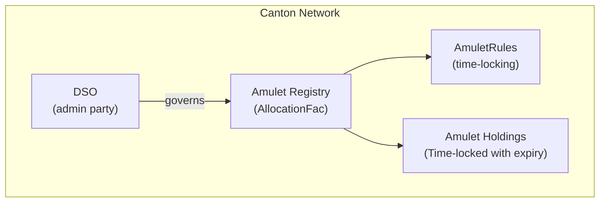
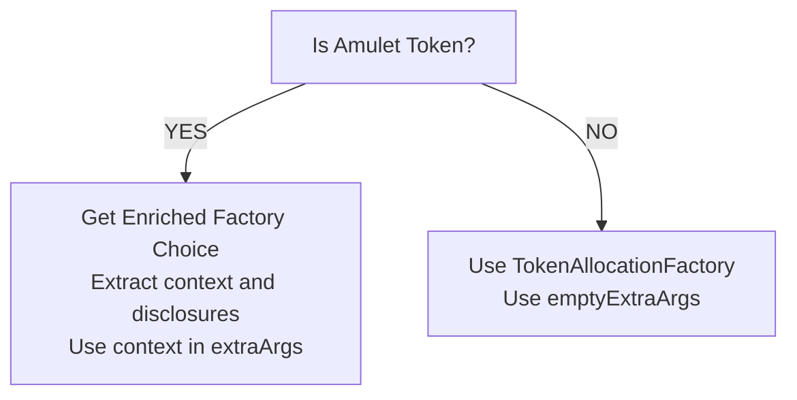
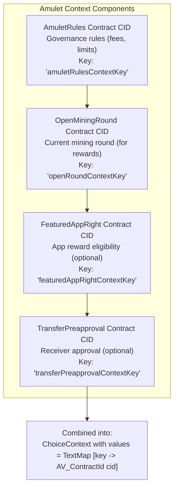
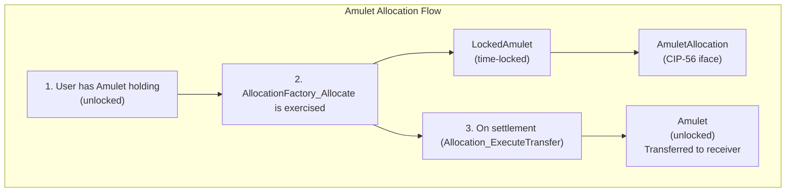
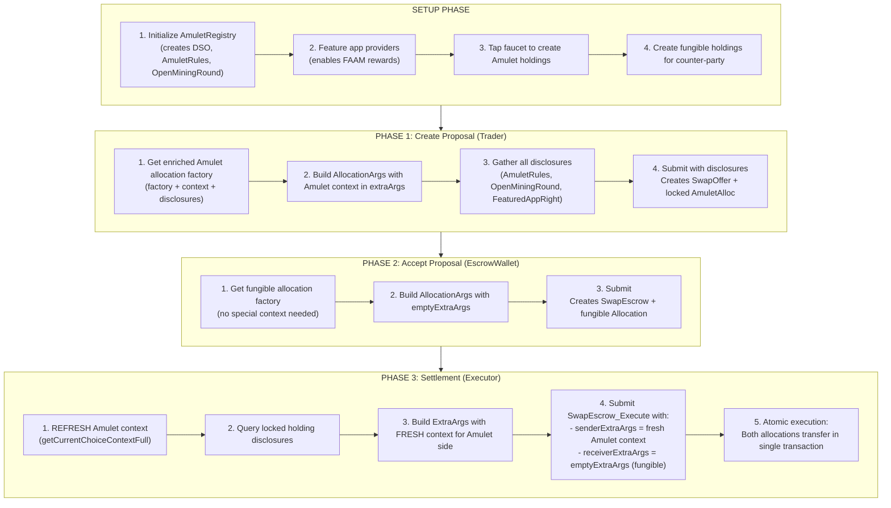

# Module 6: Amulet Token Integration

## Learning Objectives

By the end of this module, you will be able to:

- Understand Amulet token architecture and DSO governance
- Master ChoiceContext and ExtraArgs for Amulet operations
- Work with time-locked holdings
- Implement dual factory architecture for mixed token types
- Handle Amulet-specific context in settlements

---

## 6.1 What is Amulet?

**Amulet** is the native token of the Canton Network, governed by the **DSO (Decentralized Synchronizer Operator)**. Unlike standard fungible tokens, Amulet has special rules around time-locking and rewards.

### Amulet vs Fungible Tokens

| Aspect | Fungible Tokens | Amulet Tokens |
|--------|-----------------|---------------|
| **Admin** | Custom party (Bank, Issuer) | DSO party |
| **Context** | Empty (`emptyExtraArgs`) | Requires `ChoiceContext` |
| **Locking** | Optional | Time-based rules |
| **Factory** | `TokenAllocationFactory` | Amulet Registry |
| **Rewards** | None | FAAM-based CC rewards |

### Amulet Architecture



---

## 6.2 ChoiceContext and ExtraArgs

Amulet operations require runtime context that cannot be stored statically.

### Why Context is Required

1. **Dynamic Rules** - Amulet rules change over time (issuance schedule)
2. **Time-Based Locks** - Lock expiration depends on current time
3. **DSO State** - Current network state affects operations
4. **Disclosures** - Cross-party visibility requirements

### ExtraArgs Structure

```haskell
data ExtraArgs = ExtraArgs
  with
    context : ChoiceContext
    meta : Metadata

data ChoiceContext = ChoiceContext
  with
    values : TextMap AnyContract
```

### Using Empty Context (Fungible)

```haskell
import Splice.Testing.Utils (emptyExtraArgs)

-- For fungible tokens, use empty context
exercise allocationCid Allocation_ExecuteTransfer with
  extraArgs = emptyExtraArgs
```

### Using Amulet Context

Example:

```haskell
createAmuletAllocationFactory :
    AmuletRegistry.AmuletRegistry
    -> Party       -- sender
    -> Party       -- receiver
    -> Party       -- executor
    -> Script (EnrichedFactoryChoice AllocationFactory AllocationFactory_Allocate)
createAmuletAllocationFactory registry sender receiver executor = do
  now <- getTime

  let allocationSpec = AllocationSpecification with
        settlement = SettlementInfo with
          executor = executor
          settlementRef = Reference with id = "dummy"; cid = None
          requestedAt = now
          allocateBefore = now `addRelTime` minutes 10
          settleBefore = now `addRelTime` hours 1
          meta = emptyMetadata
        transferLegId = "dummy-leg"
        transferLeg = TransferLeg with
          sender = sender
          receiver = receiver
          amount = 1.0
          instrumentId = registry.instrumentId
          meta = emptyMetadata

  queryEnrichedAmuletAllocation registry allocationSpec [] now emptyExtraArgs
```

### EnrichedFactoryChoice Pattern

```haskell
data EnrichedFactoryChoice factory arg = EnrichedFactoryChoice
  with
    factoryCid : ContractId factory
    arg : arg
    disclosures : Disclosures'

-- Usage:
enrichedChoice <- createAmuletAllocationFactory registry sender receiver executor

-- Access components:
let factoryCid = enrichedChoice.factoryCid
let amuletContext = enrichedChoice.arg.extraArgs.context
let disclosures = enrichedChoice.disclosures
```

---

## 6.3 Amulet Instrument Detection

To determine if a token is Amulet, check if the admin matches the DSO party.

Example:

```haskell
-- Helper function to determine if the instrument is an Amulet token
isAmuletToken : InstrumentId -> Optional Party -> Bool
isAmuletToken instrumentId amuletAllocationFactoryAdmin =
  isSome amuletAllocationFactoryAdmin &&
  instrumentId.admin == fromSome amuletAllocationFactoryAdmin
```

### Detection Pattern

```haskell
-- In test setup
let isAmulet = isAmuletInstrumentId instrumentId (Some registry.dso)

-- Factory selection based on instrument type
let factoryCid = if isAmulet
      then amuletAllocationFactoryCid
      else fungibleAllocationFactoryCid
```

---

## 6.4 Dual Factory Architecture

The DEX uses **two factory types** to handle both token types seamlessly.

### Factory Selection

```haskell
-- AllocationFactories holds both factory types
data AllocationFactories = AllocationFactories with
  provided : ContractId AllocationFactory  -- LP's token factory
  desired : ContractId AllocationFactory   -- Trader's token factory

-- During setup, create appropriate factories
(allocationFactories, amuletContextOpt, amuletDisclosuresOpt) <-
  createAllocationFactories config expandedRoles amuletRegistry
```

### Context Handling by Token Type



---

## 6.5 Amulet in Settlement

When settling trades involving Amulet, the context must be refreshed.

### Context Refresh Before Settlement

```haskell
-- Before settlement, get current Amulet context
amuletContext <- getCurrentChoiceContextFull amuletRegistry senderAllocationCid

-- Use refreshed context in settlement
exerciseCmd swapEscrowCid SwapEscrow_Execute with
  senderExtraArgs = ExtraArgs with
    context = amuletContext.choiceContext
    meta = emptyMetadata
  receiverExtraArgs = emptyExtraArgs
  beneficiaries = None
```

### Settlement with Mixed Tokens

Example:

```haskell
-- Use Amulet context if available, otherwise use empty context
let contextToUse = fromOptional (ChoiceContext TextMap.empty) amuletContext
let metaToUse = fromOptional MetadataV1.emptyMetadata metadata

-- Execute LP -> Trader (may be Amulet or fungible)
_ <- exercise liquidityProviderToTraderAllocation Allocation_ExecuteTransfer with
  extraArgs = ExtraArgs with context = contextToUse, meta = metaToUse

-- Execute Trader -> LP (may be Amulet or fungible)
_ <- exercise traderToLiquidityProviderAllocation Allocation_ExecuteTransfer with
  extraArgs = ExtraArgs with context = contextToUse, meta = metaToUse
```

---

## 6.6 Disclosures for Cross-Party Visibility

Amulet operations require explicit disclosures for cross-party contract visibility.

### Query Disclosure

```haskell
-- Get disclosure for a contract
disclosure <- fromSome <$> queryDisclosure @SwapFactory party factoryCid

-- Combine disclosures
let allDisclosures = [disclosure1, disclosure2, disclosure3]
```

### Submit with Disclosures

Example:

```haskell
-- For SwapFactory
submit (actAs [roles.trader] <> discloseMany allDisclosures) do
  exerciseCmd factoryCid SwapFactory_CreateSwapOfferAndAllocate with
    sender = roles.trader
    receiver = roles.escrowWallet
    allocationArgs = AllocationArgs with
      extraArgs = amuletExtraArgs  -- Amulet context here
      ...

-- For PriceQuote - same disclosure pattern
submit (actAs [roles.trader] <> discloseMany allDisclosures) do
  exerciseCmd priceQuoteCid CreateTraderAllocation with
    trader = roles.trader
    amuletContext = Some enrichedChoice.arg.extraArgs.context
    ...
```

---

## 6.7 Deep Dive: Amulet Infrastructure

This section provides an in-depth look at how the Amulet infrastructure works under the hood.

> **Note:** For advanced test infrastructure patterns including `AmuletApp`, `setupDefaultAppWithUsers`, and DSO governance initialization, see **Module 9: Production Patterns**, section 9.6.

### 6.7.1 AmuletRegistry Structure

The `AmuletRegistry` is an off-ledger reference that points to the on-ledger Amulet contracts.

Example:

```haskell
-- | A reference to a mock amulet registry.
-- Use it via the token standard functions provided by the "Splice.Testing.RegistryApi" module
data AmuletRegistry = AmuletRegistry with
    dso : Party              -- The DSO (Decentralized Synchronizer Operator) party
    instrumentId : InstrumentId  -- The Amulet instrument identifier
  deriving (Eq, Ord, Show)
```

### 6.7.2 Registry Initialization

When the Amulet registry is initialized, several on-ledger contracts are created.

Example:

```haskell
-- | Initialize the mock amulet registry.
initialize : AmuletRegistryConfig -> Script AmuletRegistry
initialize config = do
  -- Use a time that is easy to reason about in script outputs
  setTime config.demoTime

  -- Allocate the DSO party - the governance authority
  dso <- allocatePartyExact config.dsoPartyName
  let registry = AmuletRegistry with
        dso
        instrumentId = amuletInstrumentId dso

  -- Configure Amulet rules (fees, holding costs, etc.)
  let amuletConfig
        | config.noTransferFee = defaultAmuletConfig with
            transferConfig = noTransferFeeConfig
        | otherwise = defaultAmuletConfig

  -- Create the AmuletRules contract (governs all Amulet operations)
  _ <- submit dso $ createCmd AmuletRules with
    configSchedule = Schedule with
      initialValue = amuletConfig
      futureValues = []
    isDevNet = True
    ..

  -- Create ExternalPartyAmuletRules (for external party interactions)
  _ <- submit dso $ createCmd ExternalPartyAmuletRules with dso

  -- Bootstrap mining rounds (for time-based rewards)
  (amuletRulesCid, _) <- getAmuletRules registry
  submit registry.dso $ exerciseCmd amuletRulesCid AmuletRules_Bootstrap_Rounds with
      amuletPrice = config.initialAmuletPrice
      round0Duration = minutes 10
      initialRound = None

  return registry
```

### 6.7.3 The RegistryApi Type Class

The `AmuletRegistry` implements the `RegistryApi` type class, which provides CIP-56 compatibility.

```haskell
instance RegistryApi AmuletRegistry where
  -- Transfer factory for direct transfers
  getTransferFactory = registryApi_getTransferFactory

  -- Allocation factory for DVP settlements
  getAllocationFactory = registryApi_getAllocationFactory

  -- Context for executing allocation transfers
  getAllocation_TransferContext app cid _meta =
    registryApi_getAllocationTransferContext app cid

  -- Context for canceling allocations
  getAllocation_CancelContext app cid _meta =
    registryApi_getAllocation_abortTwoStepTransferContext app cid

  -- ... other context methods
```

### 6.7.4 Building the Amulet ChoiceContext

The context is built by combining multiple contract references.



Example:

```haskell
-- | Context required to call an amulet rules transfer choice.
getAmuletRulesTransferContext : AmuletRegistry -> Script OpenApiChoiceContext
getAmuletRulesTransferContext registry = do
  rulesC <- getAmuletRulesContext registry     -- AmuletRules contract
  roundC <- getOpenRoundContext registry       -- OpenMiningRound contract
  pure $ rulesC <> roundC                      -- Combine contexts (Semigroup)
```

### 6.7.5 How getAllocationFactory Works

This function is called to get the Amulet allocation factory with proper context.

Example:

```haskell
registryApi_getAllocationFactory
  : AmuletRegistry -> AllocationFactory_Allocate
  -> Script (EnrichedFactoryChoice AllocationFactory AllocationFactory_Allocate)
registryApi_getAllocationFactory registry arg = do
  -- Get the ExternalPartyAmuletRules contract (implements AllocationFactory interface)
  (extAmuletRulesCid, extAmuletRulesD) <- getExtAmuletRulesWithDisclosures registry

  -- Get the transfer context (AmuletRules + OpenMiningRound)
  transferC <- getAmuletRulesTransferContext registry

  -- Combine disclosures with context
  let fullContext = withExtraDisclosures extAmuletRulesD transferC

  -- Return enriched factory choice with:
  -- 1. Factory CID (ExternalPartyAmuletRules as AllocationFactory)
  -- 2. Args with populated context
  -- 3. All required disclosures
  pure EnrichedFactoryChoice with
    factoryCid = toInterfaceContractId @AllocationFactory extAmuletRulesCid
    arg = arg with extraArgs = arg.extraArgs with context = fullContext.choiceContext
    disclosures = fullContext.disclosures
```

### 6.7.6 Context Refresh for Settlement

Before settlement, the Amulet context must be refreshed because the `OpenMiningRound` may have changed.

Example:

```haskell
registryApi_getAllocationTransferContext
  : AmuletRegistry -> ContractId Allocation -> Script OpenApiChoiceContext
registryApi_getAllocationTransferContext registry allocCid = do
  -- Get current transfer context (may have new OpenMiningRound)
  transferC <- getAmuletRulesTransferContext registry

  -- Fetch the AmuletAllocation to get executor's FeaturedAppRight
  Some amuletAlloc <- queryContractId @AmuletAllocation registry.dso (coerceContractId allocCid)
  featuredAppRightC <- getFeaturedAppRightContext registry amuletAlloc.allocation.settlement.executor

  -- Disclose the locked amulet (executor may not have visibility)
  lockedAmuletD <- queryDisclosure' @LockedAmulet registry.dso amuletAlloc.lockedAmulet

  -- Combine all context components
  pure $ withExtraDisclosures lockedAmuletD (transferC <> featuredAppRightC)
```

### 6.7.7 Disclosures Mechanism

Disclosures enable cross-party contract visibility without changing signatories.

Example:

```haskell
-- | A set of disclosures. Used to work around the fact that duplicate
-- disclosures for the same contract are not allowed.
data Disclosures' = Disclosures' with
    disclosures : Map.Map Api.Token.MetadataV1.AnyContractId Disclosure

instance Monoid Disclosures' where
  mempty = Disclosures' with disclosures = Map.empty

instance Semigroup Disclosures' where
  (Disclosures' ds1) <> (Disclosures' ds2) =
    Disclosures' with disclosures = Map.union ds1 ds2

-- | Retrieve a disclosed contract by its contract-id from a specific party's ACS.
queryDisclosure' : forall t. Template t => Party -> ContractId t -> Script Disclosures'
queryDisclosure' p cid = do
  optDisc <- queryDisclosure @t p cid
  case optDisc of
    None -> fail $ "Disclosure not found for: " <> show cid
    Some d -> pure Disclosures' with disclosures = Map.fromList [(coerceContractId cid, d)]
```

### 6.7.8 Locked Amulet and Time-Based Locks

Amulet holdings can be locked with time-based expiration.

```haskell
data TimeLock = TimeLock with
   holders : [Party]       -- Parties who can unlock
   expiresAt : Time        -- When the lock expires
   optContext : Optional Text  -- Lock description
```

When an allocation is created, the Amulet is locked:



### 6.7.9 Creating Holdings with tapFaucet

On DevNet, Amulet holdings are created via the faucet.

Example:

```haskell
-- | Tap the faucet on DevNet to get a specified amount of Amulet.
tapFaucet : AmuletRegistry -> Party -> Decimal -> Script (ContractId Holding)
tapFaucet registry user amount = do
  -- Get the current open mining round
  (openRound, _) <- getLatestOpenRound registry

  -- Get the AmuletRules contract
  (amuletRulesCid, _) <- getAmuletRules registry

  -- Get disclosures for cross-party access
  amuletRulesD <- queryDisclosure' @AmuletRules registry.dso amuletRulesCid
  openMiningRoundD <- queryDisclosure' @OpenMiningRound registry.dso openRound
  let disclosures = amuletRulesD <> openMiningRoundD

  -- Exercise the DevNet tap choice
  result <- submitWithDisclosures' user disclosures $
    exerciseCmd amuletRulesCid AmuletRules_DevNet_Tap with
      receiver = user
      amount
      openRound

  -- Return as Holding interface
  return $ toInterfaceContractId result.amuletSum.amulet
```

---

## 6.8 Complete Amulet Workflow Example

Now that we understand the infrastructure, let's see a complete workflow.

### Test Setup with Amulet

```haskell
-- Initialize Amulet infrastructure (creates DSO, AmuletRules, etc.)
(amuletRegistry, amuletInstrumentId) <- createAmuletRegistry

-- Feature the app provider (enables FAAM rewards)
executorFeaturedAppRightCid <- featureApp amuletRegistry executor

-- Create Amulet holdings for trader via faucet
forA_ [1_000_000.0] $ \amount ->
  AmuletRegistry.tapFaucet amuletRegistry trader amount
```

### Getting Amulet Allocation Factory with Context

```haskell
-- Get enriched Amulet allocation factory (includes context + disclosures)
enrichedAmuletFactoryChoice <- createAmuletAllocationFactory
  amuletRegistry trader escrowWallet executor

-- The enriched choice contains:
-- 1. factoryCid: The ExternalPartyAmuletRules as AllocationFactory
-- 2. arg: AllocationFactory_Allocate with populated extraArgs.context
-- 3. disclosures: AmuletRules, OpenMiningRound, etc.
```

### Creating Amulet Allocation

```haskell
-- Build allocation args using the enriched context
let traderAllocationArgs = AllocationArgs with
      executor = roles.executor
      amount = 100000.0
      instrumentId = amuletRegistry.instrumentId  -- Amulet instrument
      allocationFactoryCid = enrichedAmuletFactoryChoice.factoryCid
      inputHoldingCids = map fst holdings.desired
      allocateBefore = minutes 10
      settleBefore = hours 1
      extraArgs = enrichedAmuletFactoryChoice.arg.extraArgs  -- Amulet context!
      walletProxyCid = walletProxy
      featuredAppRightCid = featuredAppRights.executor
      beneficiaries = None

-- Submit with disclosures for cross-party visibility
let allDisclosures = Map.values (enrichedAmuletFactoryChoice.disclosures.disclosures)
              <> [featuredAppRightDisclosure, walletUserProxyDisclosure]

tradeProposalResult <- submit (
  actAs [roles.trader] <> discloseMany allDisclosures) do
    exerciseCmd factoryCid SwapFactory_CreateSwapOfferAndAllocate with
      sender = roles.trader
      receiver = roles.escrowWallet
      executor = roles.executor
      allocationArgs = traderAllocationArgs
      ...
```

### Refreshing Context Before Settlement

```haskell
-- IMPORTANT: Refresh context before settlement (OpenMiningRound may have changed)
amuletContext <- getCurrentChoiceContextFull amuletRegistry traderAllocationCid

-- Build fresh ExtraArgs with current context
let senderExtraArgs = ExtraArgs with
      context = amuletContext.choiceContext
      meta = emptyMetadata

-- Execute settlement with fresh context
tradeEscrowSettlementResult <- submit (
  actAs [roles.executor] <> discloseMany allDisclosures) do
    exerciseCmd swapEscrowCid SwapEscrow_Execute with
      senderExtraArgs = senderExtraArgs          -- Fresh Amulet context
      receiverExtraArgs = emptyExtraArgs         -- Fungible: no context needed
      beneficiaries = None
```

### Complete Flow Diagram



---

## 6.9 Exercises

### Exercise 6.1: Detect Token Type

Write a function that returns the appropriate factory based on instrument type.

<details>
<summary>Solution</summary>

```haskell
selectFactory :
    InstrumentId ->
    Optional Party ->
    ContractId AllocationFactory ->
    ContractId AllocationFactory ->
    ContractId AllocationFactory
selectFactory instrumentId dsoPartyOpt amuletFactory fungibleFactory =
  if isAmuletToken instrumentId dsoPartyOpt
    then amuletFactory
    else fungibleFactory
```

</details>

### Exercise 6.2: Build ExtraArgs

Write a function that builds `ExtraArgs` with optional Amulet context.

<details>
<summary>Solution</summary>

```haskell
import Splice.Testing.Utils (emptyExtraArgs)

buildExtraArgs : Optional ChoiceContext -> ExtraArgs
buildExtraArgs contextOpt =
  case contextOpt of
    Some ctx -> ExtraArgs with context = ctx, meta = emptyMetadata
    None -> emptyExtraArgs
```

</details>

---

## 6.10 Summary

### Key Takeaways

| Concept | Description |
|---------|-------------|
| **Amulet** | Canton Network native token governed by DSO |
| **ChoiceContext** | Runtime context required for Amulet operations |
| **ExtraArgs** | Container for context and metadata |
| **Dual Factory** | Separate factories for Amulet and fungible tokens |
| **Disclosures** | Cross-party visibility for contract access |

### Amulet Integration Best Practices

1. **Always check token type** - Use `isAmuletToken` for detection
2. **Refresh context before settlement** - Context may change
3. **Use enriched factory choice** - Captures context and disclosures
4. **Handle both token types** - Support mixed trades
5. **Include disclosures in submissions** - Enable cross-party access

### Next Module Preview

In **Module 7: Interface-Based Design**, you will learn:

- DAML interface concepts and benefits
- Defining interfaces with viewtypes
- Implementing interfaces in templates
- Querying and exercising through interfaces
